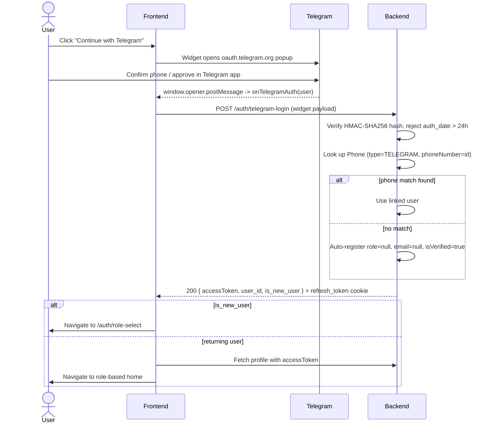
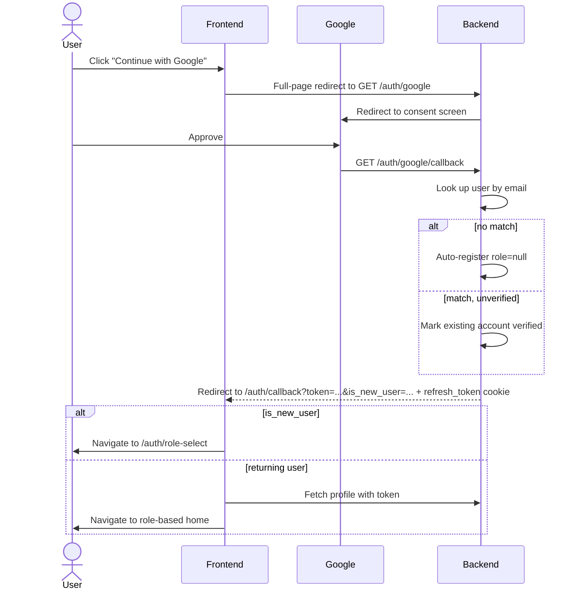

## Auth Flow

All auth endpoints are under `/auth`. Most are `@Public()` (no JWT required).

**Tokens**

| Token | Lifetime | Transport |
|---|---|---|
| Access token | 15 min | `Authorization: Bearer <token>` header |
| Refresh token | 7 days | HttpOnly cookie `refresh_token` (set by server, sent automatically by browser) |

Refresh tokens are stored in the `RefreshToken` table keyed by a UUID `jti`. Logout and password-reset atomically delete all tokens for the user.

**Registration flow**

1. `POST /auth/register` — creates the user with `isVerified: false`, enqueues a verification OTP email. Returns `{ message, user_id }` — no tokens yet.
2. `POST /auth/verify-account` — validates the OTP (SHA-256-hashed, expires in 10 min). On success, sets `isVerified: true`, deletes the OTP record, and issues both tokens.
3. `POST /auth/resend-otp` — re-sends a fresh verification OTP (overwrites the stored hash via the same `PasswordResetToken` upsert). Used when `POST /auth/login` returns 403 `not_verified`, since login itself never sends an OTP. Enumeration-safe: always returns success, silently no-ops if the email doesn't exist, is already verified, or is locked.

**Login flows**

- Email: `POST /auth/login` — validates credentials (email or phone number + password), checks `isVerified`, `isLocked`, `role !== null` (403 `role_not_selected`), and `hasPassword` (403 `password_not_set`), issues both tokens. Note: `POST /auth/verify-account` (right after registration) issues tokens directly and does **not** go through this gate, so a freshly-verified `role: null` user gets one token to reach `select-role` with — but if they don't use it and come back later, `POST /auth/login` will 403 them indefinitely (no other way for an email account to get a fresh token). This only matters if `RegisterDto.role` was omitted at registration.
- Telegram: `POST /auth/telegram-login` — verifies the HMAC-SHA256 hash from the Telegram widget, rejects `auth_date` older than 24 hours, looks up the user via `Phone` table (`type = TELEGRAM`). If no match, auto-registers a new account with `role: null`, `email: null` (pre-verified). Issues both tokens; response includes `is_new_user`.
- Google: `GET /auth/google` redirects to Google's consent screen; `GET /auth/google/callback` looks up the user by email, auto-registers a new account with `role: null` if none exists (or marks an existing unverified account as verified), issues both tokens, and redirects to `${FRONT_END_URL}/auth/callback?token=<accessToken>&is_new_user=<bool>` (refresh token set as cookie).

**Nullable identity fields**

`User.email` is nullable — Telegram-only sign-ups never get one. `Phone` is a separate relation table, not a column on `User`, so Google-only sign-ups simply have no `Phone` row (`type = TELEGRAM` or `type = PHONE`). Code that emails or SMS/Telegrams a user must handle the corresponding field being absent (see `property-report.service.ts`, which falls back from Telegram to email and skips notifying entirely if neither is available).

**Telegram sign in / sign up**

Popup-based: the widget opens an `oauth.telegram.org` popup and reports back via `window.opener.postMessage`, so the page's `Cross-Origin-Opener-Policy` must be `same-origin-allow-popups` (plain `same-origin` silently breaks the callback).

**Google sign in / sign up**

Redirect-based, not a popup — no `window.opener` involved, so it's unaffected by COOP.

**Role selection**

`User.role` is nullable and has no default — a new account (email register with `role` omitted, or an auto-registered Telegram/Google sign-up) has `role: null` until explicitly set. `RolesGuard` treats `null` as matching no role. `POST /auth/login` (email/password) additionally rejects `role: null` outright with 403 (see above) — Telegram/Telegram-login and Google callback do not, since they're the bootstrap path for brand-new accounts.

`PATCH /auth/select-role` — authenticated; onboarding-only, for accounts still missing `role` and/or a password. Rejects with `select_role_already_completed` if the account already has both (use `POST /auth/change-password` for those). `password` is always required in the body, `role` is optional:
- `password` — always overwrites `user.password` and sets `hasPassword: true`, regardless of its previous value. This is the one endpoint that lets a passwordless Telegram/Google account set a real password; for an email registrant who already has one (but is still missing `role`) it re-hashes the same/new password without a current-password check.
- `role` — only settable while `user.role` is still `null` (throws `role_already_set` otherwise). Must be `USER` or `LANDLORD`.

Every caller must send a password on this call, including email/password registrants who already have one but are only setting `role`. See `select-role.dto.ts`.

> **Frontend**: the request body contract changed — `password` is no longer optional. Any screen that calls `PATCH /auth/select-role` must always collect and send a password, even when only updating `role`.

**Token refresh**

`POST /auth/refresh-token` — validates the refresh token cookie, rotates `jti` in the DB, and returns a new access token + new refresh cookie.

**Forgot / reset password**

1. `POST /auth/forgot-password` — generates a 6-digit OTP, stores it hashed in `PasswordResetToken`, sends via the chosen channel (`email` or `telegram`). Always returns success to prevent email enumeration.
2. `POST /auth/reset-password` — validates the OTP, updates the password, and atomically deletes the OTP record and all refresh tokens (invalidates all sessions).

**OTPs** are 6 digits, SHA-256-hashed before storage, and expire in 10 minutes.
